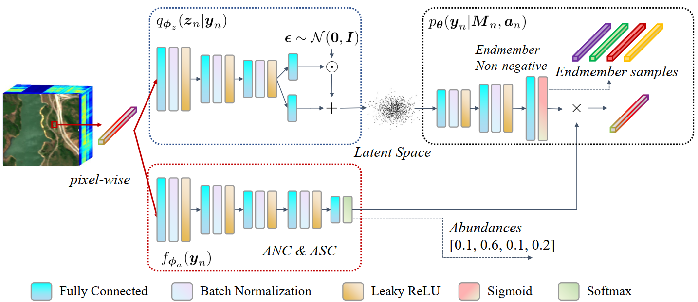

# Probabilistic Generative Model for Hyperspectral Unmixing Accounting for Endmember Variability

The code in this toolbox implements the "Probabilistic Generative Model for Hyperspectral Unmixing Accounting for Endmember Variability". More specifically, it is detailed as follow.



## Train
## Test

## Ciation
**Please kindly cite the papers if this code is useful and helpful for your research.**
```
@INPROCEEDINGS{9414940,
  author={Shi, Shuaikai and Zhao, Min and Zhang, Lijun and Chen, Jie},
  booktitle={ICASSP 2021 - 2021 IEEE International Conference on Acoustics, Speech and Signal Processing (ICASSP)}, 
  title={Variational Autoencoders for Hyperspectral Unmixing with Endmember Variability}, 
  year={2021},
  volume={},
  number={},
  pages={1875-1879},
  doi={10.1109/ICASSP39728.2021.9414940}}
 ```
## Licensing
Copyright (C) 2021 Shuaikai Shi

This program is free software: you can redistribute it and/or modify it under the terms of the GNU General Public License as published by the Free Software Foundation, version 3 of the License.

This program is distributed in the hope that it will be useful, but WITHOUT ANY WARRANTY; without even the implied warranty of MERCHANTABILITY or FITNESS FOR A PARTICULAR PURPOSE. See the GNU General Public License for more details.

You should have received a copy of the GNU General Public License along with this program.
